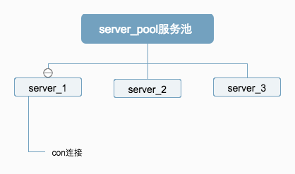

# 第一章 结构剖析

Twemproxy 主要有三部分组成

## server_pool 服务器池

服务器池:不明思议,一个池就是一个配置,配置包含所有redis的地址ip.

## server 服务器

服务器:就是单个redis.

## conn 链接

链接:代理客户端链接

## 整体流程

### 流程说明

1. 配置:不管是server_pool 还是server 都是通过配置来生成的.

2. 上下文结构context 通过上下文ctx进行信息的传递

3. 流程

### 如何通过上下文进行事件监控

1. 在上下文中定义事件

2. 在初始化上下文时绑定事件 core_core 通过获取owner 的上下文进行对应的时间操作

3. 通过事件类型执行对应方法

    1. core_error 错误

    2. core_recv  接受  对应msg_recv

    3. core_send  发送  对应msg_send

所有接受和发送都不是直接接受发送,是通过消息队列进行的.通过读取链接的多个操作,发送给redis.